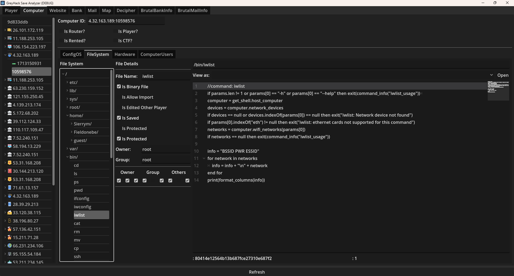
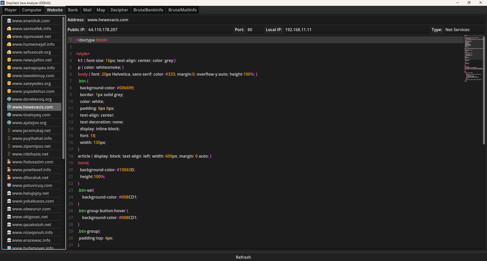
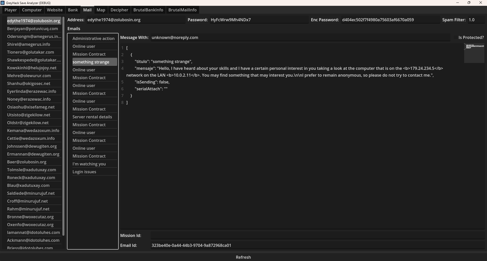

# GreyHack Save Viewer

🔍 **A lightweight save file viewer for _Grey Hack_, built with Godot Engine.**  
**Explore your Grey Hack world data with ease!**

> [!important] This project is only for single_player save files since the multi-player save files are saved on the official server and I don't have access to them.

---

## 🚀 Features

- 📂 **Load and parse** Grey Hack save files (`.db` format).
- 🖥️ **Display** player, computers, website, bank, mail, and more.
- 🛠️ **Minimalistic UI** for fast navigation and clean browsing.
- 🧩 **Cross-platform**, thanks to Godot's export system.
- 🏗️ **Modular and extensible** design — contribute your own plugins!

---

## 🛠️ Installation

1. Download the latest release from [Releases](https://github.com/Kingsmai/greyhack-save-viewer/releases) 📥  
2. Extract and run the executable for your platform.
3. Drag your Grey Hack save file into the window and start browsing! 🧠

> **Tip:** Save files are typically located in:  
> `C:\Program Files (x86)\Steam\steamapps\common\Grey Hack\Grey Hack_Data\GreyHackDB.db`

---

## 🧩 Built With

- [Godot Engine 4.4](https://godotengine.org/) — 🎮 Open-source game engine.
- [Godot SQLite](https://github.com/2shady4u/godot-sqlite) - SQLite support for Godot.
- [Kenney Asset](https://www.kenney.nl/assets/) - UI

---

## 📚 Usage

```bash
# Clone the repository
git clone https://github.com/your-username/greyhack-save-viewer.git

# Open the project in Godot

# Run or export as needed
```

---

## 🤝 Contributing

Contributions are welcome!  
If you want to add new features (e.g., visual network maps 🌐, save file editing ✍️), feel free to:

- Fork this repo
- Create a feature branch
- Submit a Pull Request

Don't hesitate to open issues for any bug reports or feature suggestions! 🚀

### 📝 Roadmaps

- [ ] Config OS visualization
  - [ ] Support for router
  - [ ] Support for computer
- [ ] Visual network maps 🌐
- [ ] Save file editing ✍️
- [ ] Bank transactions viewer 📈
- [ ] Mail message viewer (prettier) 📧
- [ ] Different file type content viewer
  - [ ] Content's
  - [ ] PDF? 📄
  - [ ] Mission file
  - [ ] Casual file
- [ ] More features and improvements! 🚀

---

⚖️ License

- This project’s codebase is licensed under the MIT License.
- However, some visual assets used in this project (such as in-game screenshots or UI elements) are sourced from the game Grey Hack, and are the intellectual property of the original developers at Loading Home. These assets are included strictly for non-commercial, educational, and illustrative purposes only.

> 🚫 Do not redistribute, modify, or reuse these assets outside the context of this tool unless you have permission from the original game developers.

📢 Disclaimer

> Grey Hack is a property of Loading Home.
> This tool is a community-driven project and is not affiliated with, endorsed by, or officially supported by the developers of Grey Hack.
> Please use this tool responsibly and in accordance with the game's terms of service and community guidelines.

## 🌟 Acknowledgements

- Thanks to the **Grey Hack** community for being awesome. 🧠💻
- Inspired by open-source hacking culture. 🕶️

---

✨ _Made with love and a bit of chaos._ ✨

---

## 🔥 Quick Preview







> Hope the developer of GreyHack won't encrypt or change the save method.
